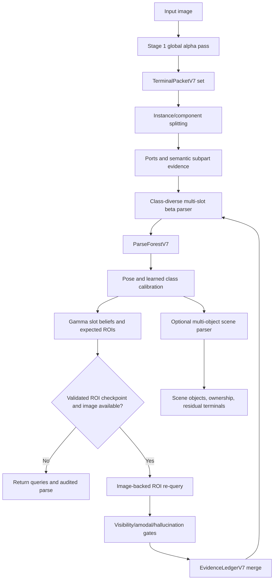
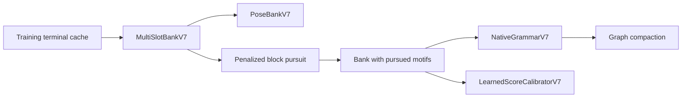

# PartImageNet ABG-HKG-AOG Core: Implemented Design and Engineering Guide

## Document status

This document describes the code currently published on branch
`codex/partimagenet-aog-core`. It is intentionally implementation-centered. A
component is called **implemented** only when an executable code path and a
corresponding data contract exist in the repository. A component is called
**tested** only when the repository test suite exercises its defining behavior.
Dataset-level accuracy or robustness is not claimed unless a completed experiment
has produced that result.

The branch is based on `v7-complete-abg-native` and deliberately excludes all
ImageNet adaptation code, transfer-learning heads, ImageNet dataset utilities,
experiment notebooks, checkpoints, terminal caches, reports, and generated run
artifacts. It contains the reusable PartImageNet model core and unit tests only.

## Executive summary

The current model is a hierarchical, attributed And-Or Graph (AOG) system whose
lowest-level observations are Stage-1 functional-part terminals. The core design
has five interacting layers:

1. **Stage-1 alpha evidence** represents visible part masks, scores, appearance
   tokens, geometry, uncertainty, optional amodal support, and ports.
2. **A native multi-slot object grammar** separates a reusable functional part
   category, such as `wheel`, from object-template addresses, such as front and
   rear wheel slots.
3. **Bottom-up beta parsing** binds distinct physical terminals to distinct slots,
   scores part and relation compatibility, and preserves class-diverse hypotheses
   before learned calibration.
4. **Top-down gamma inference** predicts missing or weak slot regions from class,
   slot, and sibling-relation context, then optionally asks an image-backed ROI
   head to verify the prediction.
5. **Scene and structure layers** reuse object hypotheses in a multi-object scene
   parser and provide conservative block pursuit, graph materialization,
   compression, and validation-gated semi-supervised expansion.

The central safety rule is:

> A graph prior may create an expected or amodal region, but only image-supported
> alpha evidence may create a visible terminal.

The central search rule is:

> Retain at least one hypothesis per candidate class before calibration and ABG;
> never let duplicate beams from one class remove all competing classes early.

## Scope

### Included in this branch

- PartImageNet Stage-1 architecture compatibility fixes.
- Configurable DINO pretrained initialization during checkpoint reconstruction.
- Typed terminal, port, query, visibility, grammar, parse, and ledger objects.
- Multi-slot discovery from terminal multiplicity and geometry.
- Shared and class-conditioned part vocabulary prototypes.
- Native AOG grammar materialization with OR, AND, terminal, relation, and motif
  nodes.
- One-terminal-per-slot assignment with repeated functional parts.
- Class-diverse candidate pruning.
- Pose-template discovery and pose-aware scoring.
- Sign-constrained learned class-score calibration.
- Explicit geometry relations and optional learned port compatibility.
- Visible, partial, occluded, truncated, absent, and unresolved states.
- ROI-query training data, losses, validation metrics, checkpoint contracts, and
  image-backed re-query execution.
- Recursive alpha-beta-gamma inference at the practical class/slot level.
- Disconnected-component and connected-blob instance splitting.
- Multi-object proposal generation, set-packing, and soft ownership diagnostics.
- Penalized Viterbi/EM-style block pursuit, motif materialization, branch pruning,
  reachability pruning, and exact-subgraph merging.
- Validation-gated semi-supervised grammar expansion.
- Unit tests for the defining safety and structural properties.

### Explicitly excluded

- ImageNet adaptation and ImageNet classification heads.
- Frozen-feature transfer experiments.
- ImageNet datasets, download helpers, checkpoints, and results.
- Full experiment runners and notebooks.
- Generated terminal caches or trained ROI checkpoints.
- A claim that all optional modules are jointly trained end to end.
- A claim of improved full-dataset accuracy without a new controlled run.

## Design goals

The implementation is organized around the following requirements.

1. **Compositionality:** object classes are explained through reusable functional
   parts, repeated part instances, slot geometry, pose alternatives, and horizontal
   relations.
2. **Multiplicity:** one semantic category may occupy multiple physical slots;
   one observed terminal cannot satisfy more than one slot in a parse.
3. **Ambiguity preservation:** the parser keeps a parse forest and class-diverse
   candidates instead of collapsing to duplicate local beams.
4. **Occlusion resilience:** missing visible evidence can remain unresolved or
   become amodal/occluded support; it must not be promoted to visibility by prior
   alone.
5. **Active perception:** high-value unresolved slots can issue spatial gamma
   queries to a trained ROI head.
6. **Auditability:** every re-query, score contribution, slot assignment,
   visibility decision, and class-switch rejection can be inspected.
7. **Controlled complexity:** new motifs, poses, and branches must satisfy support,
   gain, prior, or held-out validation criteria.

## System architecture



The offline structure path is:



## Core data contracts

### `TerminalPacketV7`

A terminal is a physical evidence packet, not merely a part label. Important
fields include:

| Field group | Fields | Meaning |
|---|---|---|
| Identity | `sample_id`, `terminal_id`, `functional_part_id` | Stable evidence identity and reusable part category. |
| Visible alpha | `visible_score`, `visible_box_xyxy`, `visible_mask` | Image-supported visible evidence. |
| Amodal support | `amodal_score`, `amodal_mask`, `amodal_box_xyxy` | Non-visible structural support; never automatically visible. |
| Semantics | `appearance_token`, `function_token`, `subpart_id`, `role_id` | Appearance/function descriptors and optional role metadata. |
| Geometry | `geometry_token`, normalized box | Spatial evidence used by slots and relations. |
| Bonds | `ports` | Typed locations such as hub, rim, root, tip, contact, or attachment. |
| Reliability | `uncertainty`, `accepted_visible`, `accepted_amodal` | Evidence gating and calibration. |
| Provenance | `source`, `source_query_id`, `parent_hypothesis_id`, `audit_flags` | Tracks global alpha, gamma re-query, and graph-prior origin. |

`EvidenceSourceV7` distinguishes `global_alpha`, `gamma_requery`, and
`graph_prior`. A graph-prior ledger entry has no visible terminal id and is marked
`prior_only_not_visible`.

### `PortPacketV7`

A port carries a type, normalized point, confidence, optional orientation, and
optional learned heatmap. Port compatibility is used only when both terminals
have learned heatmap-backed ports; geometry ports are a fallback and are not
silently treated as learned evidence.

### `GammaQueryV7`

A top-down query identifies:

- target functional part and slot/template;
- expected ROI and expected visible/amodal masks;
- source class, pose, slot, and hypothesis;
- posterior support and priority;
- neighboring/context terminal ids;
- slot relation context;
- expected semantic subparts or ports;
- a human-readable reason.

### `EvidenceLedgerV7`

The ledger is the hallucination-control boundary. It stores all alpha evidence,
graph-prior requests, accepted/rejected ROI results, superseded weak terminals,
and audit flags. Re-query evidence may inherit semantic tokens from the weak alpha
terminal it refines, but it cannot inherit visible acceptance.

When an accepted partial-slot re-query replaces a weak terminal, the old terminal
is marked `superseded_by_query_<id>` rather than counted twice.

### Grammar and parse objects

- `GrammarNodeV7`: OR, AND, or TERMINAL node with semantic type, attributes,
  priors, children, rules, and complexity cost.
- `RuleV7`: OR selection, AND composition, or termination with branch prior,
  required/optional children, relation factors, and complexity cost.
- `RelationFactorV7`: explicit relation prototype with support and reliability.
- `SlotAssignmentV7`: selected terminal, visibility, score, branch posterior,
  assignment posterior, subpart evidence, and port evidence.
- `ParseHypothesisV7`: class, pose, slots, terminal ownership, relations, score,
  and posterior.
- `ParseForestV7`: top hypotheses, normalized posterior, entropy, retained mass,
  and gamma query history.

## Native hierarchy

The materialized hierarchy is:

```text
root_scene OR
  -> object_class AND
       -> object_pose AND
            -> pursued_motif AND (optional reusable block)
                 -> functional_slot OR
                      -> slot_template AND
                           -> slot_terminal
                      -> absent slot terminal
            -> remaining functional_slot OR ...
```

The distinction between vocabulary and address is essential:

```text
functional part category: wheel
object-template slots:     wheel:0, wheel:1
physical observations:     terminal 21, terminal 34
```

The parser may bind terminal 21 to `wheel:0` and terminal 34 to `wheel:1`, but it
cannot use terminal 21 twice. This resolves the earlier one-piece-per-category
design flaw.

## Offline construction, step by step

### Step 1: obtain Stage-1 terminal records

The structure learner expects cached records with part ids, validity, scores,
boxes or masks, optional appearance tokens, and labels. The cache is converted by
`terminal_packets_from_record` into typed terminal packets.

Expected output:

```text
list[TerminalPacketV7] per image
```

Sanity checks:

- terminal ids are unique per sample;
- boxes lie in normalized image coordinates;
- repeated parts produce multiple terminals or separable mask components;
- tokens have consistent dimension;
- `accepted_visible` is true only for actual image evidence.

Unreasonable output:

- one semantic terminal covering all repeated physical instances;
- every part score near one;
- empty masks with high visible scores;
- terminal tokens with mixed dimensions;
- graph-prior evidence appearing as visible alpha.

### Step 2: split physical instances

`split_terminal_components` separates disconnected mask components.
`split_connected_blob_instances` adds a conservative fallback for a connected mask
with multiple spatial lobes. It first collapses flat peak plateaus, then uses
peak-seeded spatial k-means. Flat binary masks are deliberately not fragmented.

Expected output:

- disconnected repeated parts become separate terminal packets;
- a genuine two-lobe connected response may become two packets;
- a single flat component remains one packet;
- each child has a new id and an audit flag linking it to its parent.

This fallback is not equivalent to a trained instance-segmentation head. If two
instances form one featureless connected mask, there is insufficient evidence to
split them reliably.

### Step 3: learn reusable part vocabulary

For each part category, the bank records:

- shared part prototype across classes;
- class-conditioned part prototype;
- token mean and support;
- image occurrence rate;
- semantic subpart vocabulary.

The ontology is deliberately small and functional. For example:

- wheel: hub, rim, ground contact, attachment;
- wing: root, surface, tip, leading boundary;
- limb: root, joint, tip, contact;
- body/frame: center and directional attachment ports.

These labels are evidence summaries over ports. They are not claimed to be fully
supervised semantic subpart masks.

### Step 4: discover class-specific slots

For every `(class, part)` pair:

1. Count physical terminals per training image.
2. Estimate multiplicity from the mean and 80th percentile, capped by
   `max_slots_per_part`.
3. Cluster normalized geometry `[cx, cy, width, height]` with deterministic
   farthest-initialized k-means.
4. Drop clusters below support-image and occurrence-rate thresholds.
5. Store slot support, occurrence rate, global rate, diagnostic log ratio,
   requiredness, geometry mean/variance, and token prototype.

The diagnosticity term is approximately

```math
d_{c,s} = \operatorname{clip}\left(\log
\frac{p(s\mid c)+\epsilon}{p(s)+\epsilon}\right).
```

Requiredness is zero below `required_tau` and rises linearly toward one above the
threshold. Thus an optional mirror and a required wheel need not receive the same
missing penalty.

Expected output:

```text
MultiSlotBankV7
  slots: list[MultiSlotTemplateV7]
  relations: list[MultiSlotRelationV7]
  shared_part_prototypes
  class_part_prototypes
```

Unreasonable output:

- every repeated category has one slot despite multiple terminals;
- every class-part reaches the slot cap;
- many slots have support from one image;
- slots differ only by random tiny geometry offsets;
- requiredness is high for rare optional parts.

### Step 5: estimate slot relations

Training images are parsed with their ground-truth class slots. For every reliably
co-active slot pair, the system stores the mean and variance of a normalized box
relation vector, support, and reliability. At inference, relation similarity is a
bounded Gaussian-like compatibility:

```math
r_{ij} = \rho_{ij}\exp\left[-\frac{1}{2}
\operatorname{clip}\left(\frac{1}{D}\sum_d
\frac{(x_d-\mu_d)^2}{\sigma_d^2}, 0, 4\right)\right].
```

Optional learned-port compatibility is added only when both terminal ports came
from heatmaps. This prevents deterministic box-center fallback ports from posing
as learned relation evidence.

### Step 6: learn pose alternatives

`learn_pose_bank_v7` creates fixed-length class pose features by concatenating the
matched slot geometries in slot order. Missing slots contribute zeros. For each
class it evaluates one to `max_poses_per_class` balanced clusters and accepts a
larger pose set only if:

- every pose has enough support and class fraction;
- relative reconstruction gain exceeds `min_pose_gain`;
- an MDL-style criterion improves after the pose penalty.

This rejects the common failure where one outlier becomes its own pose branch.

### Step 7: learn candidate-score calibration

The class calibrator uses standardized features:

```text
slot_presence, slot_absence, slot_token, slot_geom,
part_token, shared_part_token, part_coverage,
missing, weak_missing, extra_unassigned,
relation, port_relation,
motif_coverage, motif_violation,
matched_slots, missing_slots, active_terms
```

The integrated trainer constrains physically meaningful signs:

- positive-only: presence, token, geometry, relation, motif coverage, matched
  slots;
- negative-only: missing evidence, extra evidence, motif violation;
- unconstrained: remaining calibrated terms and class biases.

The score is

```math
S_{cal}(c\mid I) = b_c + \sum_k w_k
\frac{f_k(I,c)-\mu_k}{\sigma_k}.
```

This replaces manually selected score coefficients and prevents pathological
solutions in which missing slots help or matched slots hurt.

### Step 8: pursue motifs and compress the grammar

The practical structure learner performs:

1. **Viterbi E-step:** find the best active slot set for each training image.
2. **Candidate M-step:** count class-conditioned co-active slot itemsets.
3. **Penalized gain:** retain itemsets whose co-activation gain exceeds structural
   cost and prior/support thresholds.
4. **Class coverage:** reserve a minimum number of motifs per represented class
   before filling the global complexity budget.
5. **Compression:** merge overlapping blocks only when the observed union exists
   and has at least as much penalized gain.
6. **Materialization:** write selected non-overlapping motifs as native AND nodes.
7. **Graph compaction:** prune weak OR rules, remove unreachable nodes/rules, and
   merge exact equivalent terminal subgraphs.

The itemset gain is

```math
G(B) = n_B\log\frac{p(B)+\epsilon}
{\prod_{s\in B}p(s)+\epsilon} - \lambda C(B).
```

This is an operational Viterbi/EM-style pursuit, not a claim of a fully converged
general latent-variable EM optimizer.

### Step 9: materialize `NativeGrammarV7`

The bank is converted into explicit nodes, rules, relation factors, absent
branches, shared vocabulary metadata, and optional motif nodes. The grammar is
validated for root, parent, and child consistency and can be serialized.

## Online inference, step by step

### Step A: global alpha evidence

The original PartImageNet Stage 1 produces part masks, scores, and tokens. The
core branch does not replace that global model. It adds a checkpoint-safe DINO
initialization flag so architecture reconstruction can avoid downloading weights
before restoring a serialized state.

### Step B: port completion

If a terminal has no learned ports, `ensure_ports` adds geometry fallback ports.
Port scoring records whether ports were learned; only learned pairs influence the
optional learned-port relation term.

### Step C: class-diverse bottom-up beta parse

For each class independently:

1. Sort slots by requiredness and support.
2. Score matching terminals of the same functional part.
3. Explore assignment and absent/unresolved branches with a bounded beam.
4. Enforce one terminal per slot assignment set.
5. Compute retained-beam active/absent and terminal-assignment marginals.
6. Keep `class_hyps_per_class` hypotheses for every class.

Only after every class has representatives may class limits or final top-k pruning
run. Pose and calibration wrappers preserve the same rule.

This fixes the diagnosed failure mode in which top-k contained several duplicate
beams from one class and the true class disappeared before calibration or gamma
inference.

### Step D: slot score

For a slot `s` and terminal `t`, the base compatibility combines terminal
evidence, normalized geometry, token similarity, and class-part diagnosticity:

```math
S_{slot}(s,t) = e(t)
\left[w_g G(s,t) + w_z\max(0,Z(s,t))\right]
+ e(t)d_{c,s}.
```

An absent branch receives a requiredness-scaled penalty. Amodal-only evidence may
contribute with `amodal_parse_weight`, but its visibility remains occluded rather
than visible.

### Step E: relation, pose, and calibrated class score

The native slot score, supported relations, pose compatibility, motif features,
and learned class features are exposed separately for audit. The integrated
calibrated parser defaults `native_score_weight` and `pose_score_weight` to zero;
they must be enabled explicitly. This avoids silently adding untrained scores to a
trained calibrator.

Recommended initial policy:

- start with calibrated unary/multiplicity features;
- sweep a small relation residual;
- enable pose or motif scales only after their ablations are neutral or positive;
- never assume a deeper graph is useful merely because it is available.

### Step F: compute alpha-beta-gamma beliefs

`ABGRecursiveEngineV7` maintains practical class and slot beliefs:

```math
b_s^{(r)} = \sigma\left(
w_\alpha\alpha_s^{(r)} +
w_\beta\beta_s^{(r)} +
w_\gamma\gamma_s^{(r)}
\right).
```

- `alpha`: local terminal-to-slot compatibility and re-query evidence;
- `beta`: bottom-up slot-composition score;
- `gamma`: class posterior multiplied by slot requiredness;
- `belief`: sigmoid-combined slot belief.

Class posterior is a softmax over the best retained score per class, not over
duplicate beams.

This is an operational class/slot-level recursive update. It is not a generic
inside-outside marginal algorithm over every arbitrary grammar node.

### Step G: produce gamma ROIs

For a matched weak slot, the observed partial box anchors the query. For a missing
slot, the engine first looks for the most reliable learned sibling relation and
transforms the class slot mean relative to the observed anchor. If no anchor is
available, it falls back to the class slot mean. The box is expanded by
`gamma_roi_expand` and rendered as an ROI-local expected mask.

Priority is proportional to:

```math
P(q) = p(c\mid I)\,\operatorname{need}(s)\,
\max(0.1, 1-\alpha_s).
```

The query scheduler reserves part of the budget for distinct candidate classes
before spending remaining queries on additional slots from the current MAP class.

### Step H: image-backed ROI re-query

`ROIRequeryHeadV7` consumes:

- image crop;
- target part embedding;
- expected mask;
- optional context map.

It predicts visible mask logits, amodal mask logits, port heatmaps, visible and
amodal scores, uncertainty, and a normalized token.

A checkpoint is accepted by `build_stage1_roi_wrapper_v7` only when its contract
and held-out metrics satisfy configured gates. The contract checks include:

- negative ROI supervision;
- ROI-local mask coordinates;
- held-out presence F1 and visible IoU;
- mean negative visible score;
- blank, white, and noise acceptance rates;
- fully occluded visible false-positive rate;
- fully occluded amodal recall.

Random or unvalidated ROI heads are not appropriate for performance runs.

### Step I: visibility and hallucination gates

The ROI mask is projected into normalized image coordinates. Acceptance considers:

- visible score;
- actual predicted mask fraction;
- uncertainty;
- visible/amodal supervision contract;
- local texture standard deviation and edge energy;
- duplication against existing same-part terminals;
- visibility thresholds and truncation.

Examples:

```text
high graph support + no predicted mask       -> unresolved, not visible
high amodal score + no visible support       -> occluded/amodal, not visible
weak partial alpha + verified ROI mask       -> partial or visible refinement
ROI overlaps existing independent terminal  -> duplicate rejected
uniform crop with unsupported mask           -> visible evidence rejected
```

### Step J: transactional evidence merge

Accepted evidence is evaluated as a batch. By default, a re-query batch that
changes the predicted class is rejected unless class switching is explicitly
enabled and passes score-gain, source-class, and visible-evidence gates. This
prevents a top-down query from self-confirming a different class through one weak
terminal.

The loop stops when:

- no query remains;
- no image-backed Stage 1 is available;
- entropy change is below the convergence threshold;
- `max_rounds` is reached.

Every round records entropy before/after, emitted and accepted queries, class
beliefs, slot beliefs, and class-switch rejection.

## Visibility and occlusion

The implemented visibility states are:

| State | Meaning |
|---|---|
| `visible` | Strong image-supported visible evidence. |
| `partially_visible` | Weak/local visible evidence below the full threshold. |
| `occluded` | Accepted amodal support without visible acceptance. |
| `truncated` | Expected box lies substantially outside the image. |
| `absent` | Optional grammar branch selected. |
| `unresolved` | Required or queried part lacks adequate evidence/explanation. |

`LayerStateV7` can store visible/amodal masks, occluder id, layer depth,
occlusion boundary, and confidence. The object parser uses visible and amodal
evidence separately. A full learned depth-order/occluder estimator is not claimed.

## Multi-object scene parsing

`MultiObjectSceneParserV7` reuses object hypotheses as scene candidates:

1. Generate whole-set and spatially clustered terminal subsets.
2. Normalize each subset to a local object frame.
3. Parse each subset with the object parser.
4. Score candidate utility from posterior, covered evidence, and object cost.
5. Jointly choose disjoint candidates with beam set-packing.
6. Penalize duplicate classes and residual unexplained terminals.
7. Compute soft ownership over all candidate objects containing each terminal.

The scene parser outputs object class, score, posterior, object box, terminal ids,
ownership probabilities, residual terminal ids, candidate count, and ownership
entropy.

This is a practical object-template reuse path. It is not a full learned scene
layout grammar or differentiable joint instance segmentation model.

## ROI training design

`ROICacheDatasetV7` builds aligned crops from cache records that contain image
tensors or can resolve them through `IndexedImageProviderV7`. It creates:

- positive part crops;
- wrong-part negatives;
- background negatives;
- synthetic blank/white/noise negatives;
- partial synthetic occlusion;
- full synthetic occlusion;
- coarse expected masks;
- pseudo-port heatmaps;
- optional terminal-token targets.

The loss is

```math
\mathcal{L}_{ROI} =
\lambda_{vb}\mathcal{L}_{visible\_BCE} +
\lambda_{vd}\mathcal{L}_{visible\_Dice} +
\lambda_{ab}\mathcal{L}_{amodal\_BCE} +
\lambda_{ad}\mathcal{L}_{amodal\_Dice} +
\lambda_p\mathcal{L}_{presence} +
\lambda_{ap}\mathcal{L}_{amodal\_presence} +
\lambda_z\mathcal{L}_{token} +
\lambda_o\mathcal{L}_{port} +
\lambda_u\mathcal{L}_{uncertainty}.
```

Evaluation reports visible and amodal overlap, positive/negative score behavior,
synthetic occlusion behavior, and acceptance on adversarial gamma-conditioned
blank/white/noise inputs. Those metrics become part of the checkpoint contract.

## Semi-supervised expansion

The expansion path parses unlabeled records, finds recurring high-confidence parts
not explained by low-score parses, and proposes branches under gain and structural
consistency thresholds. If held-out validation records are provided, the grammar
is deep-copied before expansion and rolled back when accuracy drops beyond the
allowed tolerance.

Without validation records, the report marks the expansion as unvalidated. Such a
grammar should not replace the baseline in a scientific result.

## Important implementation improvements in this branch

| Previous failure/design flaw | Current correction |
|---|---|
| Functional part category treated as one slot. | Multi-slot bank indexed by class, part, and slot; one terminal cannot fill multiple slots. |
| Global top-k filled with duplicate beams from one class. | Per-class hypothesis retention before pose, calibration, ABG, and final pruning. |
| Class/pose ids lost through AND nodes. | Chart parser propagates class and pose attributes through OR and AND nodes. |
| Gamma query used generic/full-image region. | Slot mean or relation-aligned expected ROI with local expected masks. |
| Graph prior could be mistaken for visible evidence. | Evidence ledger plus visible/amodal acceptance gates. |
| Weak re-query duplicated an existing terminal. | Duplicate IoU gate and supersession of refined weak terminals. |
| Re-query could self-confirm a new class. | Transactional class-switch guard. |
| Random/unvalidated ROI head could be used as if trained. | Checkpoint contract and held-out metric validation. |
| Unconstrained calibration learned wrong score signs. | Sign-constrained monotonic feature weights. |
| Relation branch could dominate. | Support/reliability gates, bounded similarity, normalized residual features, explicit scale. |
| Pose clustering made outlier-only branches. | Balanced clusters, minimum support/fraction, gain, and MDL criterion. |
| Block pursuit exhausted budget on early classes. | Per-class coverage before global complexity fill. |
| Compression merged arbitrary overlaps. | Require an observed, competitive union candidate; also prune unreachable graph and exact duplicates. |
| Component splitter could fragment a flat mask. | Peak-plateau collapse before connected-blob splitting. |
| Amodal output consumed without supervision. | Amodal/port/token heads enabled only when checkpoint contract marks them supervised. |

## Parameters and practical tuning

### Native and visibility parameters

| Parameter | Default | Effect | Failure signal |
|---|---:|---|---|
| `visible_tau` | 0.55 | Full-visible threshold. | Too high: excessive partial/unresolved; too low: hallucinated visibility. |
| `partial_tau` | 0.25 | Minimum weak visible evidence. | Too high: no partial recovery; too low: noisy partial slots. |
| `amodal_tau` | 0.65 | Amodal acceptance threshold. | Too low: prior-shaped amodal hallucination. |
| `amodal_parse_weight` | 0.25 | Structural support from amodal-only terminals. | Too large: occluded evidence dominates classification. |
| `relation_weight` | 0.35 in native config | Explicit relation contribution. | Relation ablation outperforms enabled model. |
| `port_weight` | 0.10 | Learned-port residual. | Nonzero effect when ports are geometry fallback only. |
| `relation_min_support` | 6 | Relation support gate. | Too low: noisy class priors; too high: few active edges. |
| `hallucination_penalty` | 0.40 | Penalty for unsupported terminal branch. | Unsupported branches win frequently. |

### Slot and parser parameters

| Parameter | Typical starting value | Guidance |
|---|---:|---|
| `max_slots_per_part` | 4-6 | Increase only when Stage 1 exposes real multiplicity. |
| `min_slot_support` | 3+ observations | Also require support images and rate. |
| `required_tau` | 0.35 | Raise if optional parts receive strong missing penalties. |
| `beam_per_class` | 48-64 | Increase only after candidate diversity is confirmed. |
| `class_hyps_per_class` | 1 | Use more only for meaningful assignment or pose diversity. |
| `candidate_class_limit` | at least final top-k | Must be applied after per-class retention. |
| `top_k` | 5 | Monitor unique classes, true-class recall, and entropy. |
| `missing_weight` | 1.25 | Tune with required-slot calibration, not alone. |

### ABG parameters

| Parameter | Default | Guidance |
|---|---:|---|
| `max_rounds` | 3 | One round first; add rounds only if accepted queries help. |
| `query_budget` | 4 | Keep small until query precision is established. |
| `candidate_classes` | 5 | Must match a class-diverse parse forest. |
| `gamma_diverse_class_reserve` | 2 | Gives competing classes image-grounded checks. |
| `gamma_min_priority` | 0.015 | Raise when too many low-value queries are emitted. |
| `gamma_roi_expand` | 1.35 | Increase for localization uncertainty; excessive size raises false positives. |
| `allow_requery_class_switch` | false | Enable only after score-gain and evidence tests are reliable. |
| `convergence_entropy_delta` | 0.001 | Stop when recurrence no longer changes beliefs. |

### ROI acceptance parameters

| Parameter | Default | Purpose |
|---|---:|---|
| `requery_mask_tau` | 0.50 | Threshold predicted visible mask. |
| `requery_min_mask_fraction` | 0.002 | Reject empty/tiny predicted support. |
| `requery_max_uncertainty` | 0.75 | Reject unreliable alpha evidence. |
| `requery_duplicate_iou` | 0.45 | Prevent duplicate same-part terminals. |
| `requery_min_texture_std` | 0.01 | Image-support gate. |
| `requery_min_edge_energy` | 0.005 | Image-support gate. |
| ROI wrapper `min_accept_score` | 0.85 | Conservative performance-run acceptance. |

### Structure parameters

| Parameter | Typical start | Guidance |
|---|---:|---|
| `max_poses_per_class` | 2-4 | Inspect support and outlier rejection. |
| `min_pose_support` | 6+ | Scale with class size. |
| `pose_mdl_penalty` | 0.08 | Raise when pose count grows without validation gain. |
| `max_blocks` | 32 | Global complexity budget with class coverage. |
| `max_block_size` | 4 | Larger motifs need substantially more support. |
| `penalty_weight` | 0.10 | Raise when motifs are numerous/generic. |
| `min_block_prior` | 0.03 | Avoid rare accidental motifs. |

## Output analysis by design stage

| Stage | Primary output | Reasonable result | Unreasonable result / likely cause |
|---|---|---|---|
| Stage 1 cache | terminal packets | Diverse part scores, localized masks, consistent tokens | High scores with empty masks; repeated instances merged; broken Stage 1 or terminalization |
| Instance split | physical terminals | Repeated lobes/components split conservatively | Flat masks fragmented into many parts; peak logic too permissive |
| Slot bank | slots per class/part | Multiplicity follows observed counts; variable slot count | Every category has one slot or reaches cap; merged terminals or cap-driven discovery |
| Relations | supported slot edges | Reliability tracks class support | Relations help only through class prior or hurt no-relation ablation |
| Pose bank | supported alternatives | Multiple poses only for substantial clusters | Tiny outlier pose; thresholds too weak |
| Class-diverse parse | parse forest | Several unique classes; true-class candidate recall high | Top-k contains one class; pruning order bug |
| Calibrator | signed feature weights | Matched/presence positive, missing/extra negative | Missing positive or matched negative; unconstrained/collapsed candidates |
| Gamma scheduler | slot-specific ROIs | Queries target weak/missing slots from several candidates | Full-image ROIs or repeated identical query; missing relation/slot grounding |
| ROI re-query | accepted/rejected results | Nonzero benefit with low hallucination and valid checkpoint | Many accepted blank/noise crops; collapsed ROI head |
| ABG recurrence | before/after traces | entropy or correct-class margin improves for accepted queries | Queries emitted but zero execution; no image/checkpoint; or recurrence raises entropy |
| Visibility | state counts | visible/partial/occluded/unresolved vary with evidence | All visible, no occluded ever, or graph priors visible |
| Scene parser | objects/ownership | Disjoint ownership, low residual on synthetic two-object scenes | Duplicate objects reuse same terminals; object candidates not localized |
| Structure learning | motifs/grammar size | gain exceeds penalty and validation remains stable | Node growth without likelihood/validation gain |

## Required diagnostic metrics

Every serious run should report at least:

### Classification and candidate quality

- top-1 and per-class accuracy;
- true-class rank and candidate recall;
- mean unique candidate classes;
- parse entropy and class margin;
- confusion matrix, especially known collapse groups;
- native, pose, calibration, motif, relation, and port score attribution.

### Slot and grammar quality

- slots per `(class, part)` and support distribution;
- multiplicity gap and missing required slots;
- part-template and assignment posterior distributions;
- active/absent branch use;
- relation coverage, support, and true-vs-wrong-class score gap;
- pose count, support, and reconstruction gain;
- motif count, net gain, class coverage, and graph size before/after compression.

### Re-query quality

- queries emitted, executed, accepted, rejected, and deduplicated;
- query precision on missing and partial slots;
- before/after entropy, class margin, slot state, and mask evidence;
- hallucinated visible terminal rate;
- class-switch rejection count;
- checkpoint contract metrics;
- blank/white/noise acceptance rates.

### Scene quality

- object count accuracy;
- class multiset accuracy;
- terminal ownership accuracy;
- duplicate object rate;
- residual terminal count;
- ownership entropy.

## Recommended experiment sequence

1. **Terminal audit:** verify repeated physical parts and masks before graph learning.
2. **Unary multi-slot baseline:** no relation, pose, motif, or ABG.
3. **Class-diverse pruning check:** require multiple unique classes and high
   true-class candidate recall.
4. **Learned calibrator:** compare with native unary score; inspect weight signs.
5. **Relation residual sweep:** use small scales and keep only neutral/positive
   settings.
6. **Pose ablation:** enable pose score after pose support audit.
7. **Motif ablation:** pursue/materialize blocks, then compare validation and graph
   complexity.
8. **ROI checkpoint training:** train with positives, negatives, partial and full
   occlusion; enforce contract gates.
9. **One-round ABG:** measure actual before/after utility, not query count.
10. **Two/three-round ABG:** proceed only if one round is beneficial and stable.
11. **Controlled occlusion:** random, directional, part-targeted, and foreground
    occluders.
12. **Synthetic multi-object scenes:** object count, classes, and ownership.
13. **Real multi-object subset:** only after synthetic ownership is reliable.
14. **Semi-supervised expansion:** always provide held-out validation and retain
    rollback.

## Success gates

Do not call an optional component successful merely because it runs.

### Parser gate

- top-k contains class-diverse candidates;
- true-class candidate recall is materially higher than top-1;
- increasing beam width does not merely add duplicates;
- slot multiplicity is visible in learned templates and assignments.

### Relation gate

- enabled accuracy is not worse than no-relation beyond expected noise;
- relation contribution is bounded and support-gated;
- true class has a positive relation gap on the intended classes.

### ROI/ABG gate

- checkpoint passes all contract metrics;
- accepted query precision is high;
- accepted queries reduce unresolved slots or improve correct-class margin;
- hallucinated visible parts do not increase;
- blank/white/noise crops are rejected.

### Structure gate

- motifs have positive penalized gain and adequate support;
- graph size is controlled after compaction;
- held-out accuracy or robustness is neutral/positive;
- semi-supervised branches survive validation or are rolled back.

## Library usage outline

The branch intentionally omits experiment-specific runners. The model core can be
assembled through public APIs as follows:

```python
from partcat_hkg.abg_aog_v7 import (
    ABGBeliefConfigV7,
    ABGRecursiveEngineV7,
    CalibratedNativeMultiSlotParserV7,
    ClassDiverseNativeMultiSlotParserV7,
    MultiObjectSceneParserV7,
    Stage1ROIWrapperConfigV7,
    V7NativeConfig,
    apply_pursued_blocks_to_bank_v7,
    build_multislot_bank_from_records,
    build_native_grammar_from_multislot_bank,
    build_stage1_roi_wrapper_v7,
    learn_pose_bank_v7,
    penalized_em_block_pursuit_v7,
    train_multislot_calibrator_v7,
)

bank = build_multislot_bank_from_records(
    train_records,
    class_names=class_names,
    part_names=part_names,
    max_slots_per_part=6,
    min_slot_support=3,
    min_relation_support=6,
)

block_report = penalized_em_block_pursuit_v7(bank, train_records)
bank = apply_pursued_blocks_to_bank_v7(bank, block_report)
grammar = build_native_grammar_from_multislot_bank(bank)

pose_bank = learn_pose_bank_v7(bank, train_records)
calibrator = train_multislot_calibrator_v7(bank, train_records)

parser = CalibratedNativeMultiSlotParserV7(
    bank,
    calibrator,
    pose_bank=pose_bank,
    class_hyps_per_class=1,
    candidate_class_limit=5,
    top_k=5,
    native_score_weight=0.0,
    pose_score_weight=0.0,
)

engine = ABGRecursiveEngineV7(
    bank,
    parser=parser,
    cfg=V7NativeConfig(),
    abg_cfg=ABGBeliefConfigV7(max_rounds=3, query_budget=4),
)

# Cache-only inference emits grounded gamma queries but cannot execute them.
result = engine.run(initial_terminals, sample_id=sample_id)

# Image-backed recurrence requires a validated trained ROI checkpoint.
stage1_roi = build_stage1_roi_wrapper_v7(
    Stage1ROIWrapperConfigV7(checkpoint="roi_requery_v7.pt")
)
result = engine.run(
    initial_terminals,
    image=image_tensor,
    stage1=stage1_roi,
    sample_id=sample_id,
)

scene_parser = MultiObjectSceneParserV7(parser)
scene = scene_parser.parse(scene_terminals)
```

The exact cache-loading and image-provider code is dataset-specific and therefore
not included in this core-only branch.

## Test coverage

The published branch passes `80` tests. New core behavior is directly covered by:

- `test_abg_aog_v7_multislot_native.py`: repeated slots, grammar materialization,
  native parsing, class/pose propagation.
- `test_abg_aog_v7_class_diverse_pruning.py`: per-class retention before top-k.
- `test_abg_aog_v7_complete_abg.py`: slot beliefs and missing-slot gamma queries.
- `test_abg_aog_v7_roi_grounding.py`: aligned ROI data, negative supervision,
  visible/amodal separation, pseudo ports, empty-mask rejection, observed-mask
  localization, texture/edge gates, duplicate rejection, partial replacement,
  contract validation, transactional class-switch rejection, connected splitting,
  and calibrated-score isolation.
- `test_abg_aog_v7_structure_learning.py`: block coverage and motif
  materialization, outlier-resistant pose selection, native semi-supervised branch
  attachment, graph pruning, scene set-packing and ownership, shared vocabulary,
  synthetic scene metrics, and amodal-only occluded support.

Validation command:

```bash
PYTHONPATH=src /home/dfli/anaconda3/envs/partviz/bin/python -m pytest -q
```

Result at publication:

```text
80 passed
```

## Module map

| Module | Responsibility |
|---|---|
| `types.py` | Typed evidence, grammar, parse, query, visibility, and ledger contracts. |
| `multislot_native.py` | Slot discovery, vocabulary prototypes, relation statistics, slot parser, grammar materialization. |
| `class_diverse_parser.py` | Per-class retention and class-diverse pruning. |
| `grammar.py` | Native AOG graph construction, validation, and serialization. |
| `chart_parser.py` | Generic bounded OR/AND/terminal parser for native grammars. |
| `abg_recursive.py` | Recursive class/slot alpha-beta-gamma beliefs and query scheduling. |
| `roi_requery_head.py` | Lightweight neural image-crop alpha head. |
| `queryable_stage1.py` | ROI execution, projection, acceptance gates, and terminal construction. |
| `roi_training.py` | ROI dataset, synthetic occlusion/negatives, losses, training, and evaluation. |
| `occlusion.py` | Visibility decisions, layered state, and hallucination penalties. |
| `port_bonds.py`, `port_heatmaps.py` | Port ontology, fallback geometry, heatmap conversion, compatibility. |
| `complete_extensions.py` | ROI checkpoint contract, vocabulary features, poses, scene parser, structure pursuit, connected splitting. |
| `complete_extensions_integrated.py` | Class-diverse pose/calibration integration and sign-constrained training. |
| `graph_compact.py` | Weak-branch pruning, reachability pruning, exact-subgraph merging. |
| `semisup_loop.py`, `delta_expansion.py` | Data-driven branch proposals and validation rollback. |
| `terminal_components.py`, `terminal_adapter.py` | Cache conversion and disconnected component handling. |

## Current limitations and non-claims

1. **No trained ROI checkpoint is shipped.** The image-backed code path exists,
   but real recurrence requires a checkpoint that passes the contract.
2. **The global Stage 1 remains the original model.** The ROI head is a separate
   local decoder and is not yet jointly optimized with the entire AOG in this
   branch.
3. **ABG beliefs operate at class and slot level.** This is not full generic
   inside-outside belief propagation over every native node and relation factor.
4. **Pose alternatives are geometry-clustered.** They are not supervised by pose
   labels.
5. **Semantic subparts are port-derived labels.** They are not independently
   segmented, fully supervised subpart instances.
6. **Connected-blob splitting is heuristic.** Ambiguous connected masks still need
   a trained instance-aware Stage 1.
7. **Scene parsing is set-packing over object hypotheses.** It does not yet learn a
   rich scene-layout AOG or explicit depth ordering end to end.
8. **Block pursuit is practical Viterbi/EM-style structure search.** It is not a
   proof of globally optimal AOT structure.
9. **The optional modules need ablations.** Relations, poses, motifs, scene
   parsing, and recurrence should be retained only when controlled evaluation is
   neutral or positive.
10. **No ImageNet result belongs to this branch.** Any ImageNet training or
    transfer experiment must live in a separate branch and must not be interpreted
    as validation of this PartImageNet core.

## Recommended next engineering milestone

The next milestone should not add another architectural layer. It should produce a
reproducible PartImageNet experiment package outside this core branch that:

1. generates instance-aware terminal caches;
2. trains and validates the ROI head with the checkpoint contract;
3. builds the slot, pose, relation, motif, grammar, and calibrator artifacts;
4. runs unary, relation, pose, motif, one-round ABG, occlusion, and scene
   ablations;
5. saves all stage outputs listed in the diagnostic table;
6. reports multi-seed mean and standard deviation;
7. promotes only components that pass their success gates.

That experiment should consume this branch as a model library rather than adding
dataset-specific adaptation back into it.
